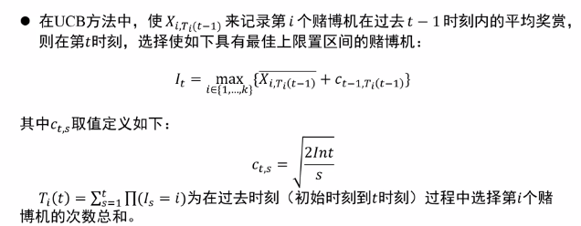
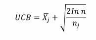
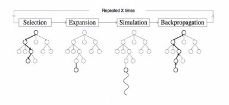

# 蒙特卡洛树搜索算法部分报告

* 林灿东 3160103968 计科1601
* 夏文星 3160101801 计科1602

## 0. 问题的形式化描述

目标：集结棋AI算法

* **状态**：当前棋盘的状态。本次实验采取的具体实现为一个int [64]数组，但后面反思到，如果使用位棋盘会有更好的性能（用两个int64来表述一个棋盘状态，各自表示黑/白棋在棋盘上的位置）。
* **动作**：将一个棋子沿横、纵、斜线做直线移动至敌棋或空位处，途中可以穿过己棋，其移动步数必须正好等于该线上所有棋子的总数。
* **状态转移**：从一个棋盘状态转移到另一个棋盘——int[64]->int[64]。
* **路径**：棋盘序列。
* **目标测试**：测试当前棋盘是否有一方获胜：若一方的所有棋子实现8连通，或者将对手棋子吃剩1个，则该方获胜。


## 1. 算法简介

### 1.1 单一状态蒙特卡洛规划——问题的起源

* **多臂赌博机**——序列问题的研究

  有k台这样的赌博机：每台赌博机有一个拉杆，拉动拉杆其会在赌博机转盘上转出不同的奖励，并且哪个赌博机可能产生哪些奖励是未知的，每次拉动拉杆也都是独立随机事件。多臂赌博机问题研究的是：有k台这样的赌博机，每次只能拉动一个拉杆，如何找到一个操作序列使得n次拉动拉杆得到的总收益最大化。

* **解决问题的关键**——平衡经验与风险的最庸

  * 利用经验：利用过去的决策结果——多拉动收益高的赌博机，以获得稳定的回报
  * 适当冒险：以一定几率去使用过去没用过的决策——以一定几率去冒险拉动那些没拉过的赌博机，以期望获得更高的回报。因为若去拉动一台被多次拉动的赌博机，收益将接近于期望。而拉动那些很少被拉动的赌博机，有可能获得很高(或很小)的收益

* **上限置信区间算法(UCB)**——将经验与冒险相平衡

  

  * ***I***<sub>***t***</sub>为在t时刻拉动赌博机***i***获得的收益，是根据前t-1时刻计算出来的估计收益。算法的主要目标就是：**在t时刻，选择本次估计收益最高的赌博机来拉动。**
  * ***X***<sub>***i, T***<sub>***i***</sub>***(t-1)***</sub>为赌博机***i***在前面的***t-1***时刻中获得的平均收益
  * ***c***<sub>***t-1, T***<sub>***i***</sub>***(t-1)***</sub> 的作用是：参考在前面***t-1***的时刻中赌博机***i***拉动的次数，来计算冒险拉动此赌博机的收益。可以看到，如果此赌博机过去被很少拉动，则此项值较大，因此会更倾向于冒险来拉动此赌博机。


### 1.2 蒙特卡洛树搜索算法

* **将UCB算法应用于搜索**

  * 棋盘(board)与当前的执棋方(turn)视为一个状态

  * 首个状态，即AI当前面对的状态视为状态树的根节点

  * 一个节点的子节点(t+1时刻)为父节点(t时刻)下一步棋后(进行一次状态转移后)的新状态，且一个节点的所有子节点分别对应其每一个不同的状态转移

  * 每个节点维护A和B两个值。**A表示经过此节点，黑方赢的次数。B表示经过此节点的次数**。

  * 对于一个父节点来说，参考UCB算法来计算一个子节点的收益：

    UCB收益由如下两项组成：

    

    * 第一项：子节点的平均收益。在搜索树算法中，若子节点为黑方，此项为A/B；若子节点为白方，此项为1 - A/B
    * 第二项：子节点的**潜力**值，即冒险选择此节点的收益。在搜索树算法中，此项计算方式不变，但其前面的参数可以调整，通常为**根号2**

  * 搜索树算法的目标是在根节点(t时刻)的所有子节点(所有赌博机)中，选择预计收益最大的节点所对应的落子策略(拉动哪个赌博机)

* **算法流程**：

  

  首先根据当前棋盘状态建立一棵只有根的搜索树。

  迭代以下流程x次：

  1. **选择(Selection)**：从根节点出发，选择一个我们可以拓展子节点的节点**P**。这和节点可能处在以下三种状态：
     * 节点还有没拓展完的节点，即当前节点还有没有使用过的落子策略。若然，进入(2)
     * 节点的所有子节点都被拓展完，则递归地从收益最大的子节点中选择子节点
     * 节点不可落子，即在当前节点没有不存在任何落子策略，则直接进入(3)

  2. **拓展(Expansion)**：从**P**节点的状态中，选择一个没有使用过的落子策略，作用在**P**的棋盘上，并用新棋盘生成子节点**C**

  3. **模拟(Simulation)**：从**C**节点开始，程序在C的棋盘上模拟一次落子。每模拟完一次落子，程序换成相反执棋方。如果新状态(棋盘)为终结状态，即游戏已经出现了胜负方，则进入(4)。否则重复(3)

  4. **反向传播(Backpropagation)**：根据游戏结果，更新**C**节点的A、B值。节点的B+=1，且若黑方胜则A+=1。然后沿着此次迭代过程中状态树上的状态路径，从下往上传播这一游戏结果，逐个更新路径上所有节点的A值与B值。

  迭代结束后，从根节点选出收益最大的子节点，并将生成子节点的对应的落子策略作为结果返回。


## 2. 算法实现

### 2.1 数据结构

```java
// 8*8棋盘。-1:空, 0:黑, 1:白
int[64] board;

// action/一个落子策略。表示将棋子从(x0, y0)移动至(x1, y1)
class Move{
    int x0, y0;
    int x1, y1;
}

// 搜索树结点
class Node{
	int[] board; // 棋盘
    int turn; // 本节点是哪个执棋方。0:黑方，1:白方
    Node parent; // 父节点
    ArrayList<Node> child; // 子节点
    ArrayList<Move> totalMoves; // 本节点所有的落子策略
    ArrayList<Move> remainMoves; // 本节点尚未拓展的落子策略
    Move producedMove; // 本节点是由父节点的哪个策略拓展而来的
}
```


### 2.2 算法实现

#### 2.2.1 关键算法的伪代码

* 主方法

  ```java
  // 传入一个执棋方和棋盘状态，返回执棋方的一个落子策略 
  Move makeMove(
      int turn, // 执棋方
      int []board // 棋盘状态
  ) {
      // 新建搜索树根节点
      Node root = new Node(
          parent = null,
          turn = turn,
          producedMove = null,
          board = board.clone()
      );
  
      // 迭代执行算法的4步流程
      for (int i = 0; i < maxIteration; ++i) {
          root.search();
      }
  
      // 搜索结束后，选择收益最大的子节点
      Node bestChild = root.maxChild();
  
      // 返回生成最佳子节点的落子策略
      return bestChild.producedMove;
  })
  ```

* 迭代流程相关函数

  ```java
  class Node{
      int[] board; // 棋盘
      int turn; // 本节点是哪个执棋方。0:黑方，1:白方
      Node parent; // 父节点
      ArrayList<Node> child; // 子节点
      ArrayList<Move> totalMoves; // 本节点所有的落子策略
      ArrayList<Move> remainMoves; // 本节点尚未拓展的落子策略
      Move producedMove; // 本节点是由父节点的哪个策略拓展而来的
      
      // 一次迭代流程
     	boolean search(){
          /* [select]
          选择出搜索树上最迫切需要拓展子节点的节点 */
      	Node selectedNode = this.select(); 
  
          // 如果没有子节点有可拓展的节点，则说明搜索过程可提前结束
          if (selectedNode == null) {
              return false;
          }
          
          /* [expand]
          如果找到，则拓展出一个子节点 */
          Node expandedNode = selectedNode.expand();
  
          /* [simulate]
          在刚拓展的新节点上模拟一定次数的对弈 */
          for (let i = 0; i < simulateTime; ++i) {
              // 记录每次模拟的游戏结果
              int gameResult = expandedNode.simulate();
  			// 将游戏结果反向传播，更新状态路径上的节点的A、B值
              expandedNode.backPropagation(gameResult);
          }
          return true;
      }
      
      /* [select] */
      /* 从搜索树上选择出最迫切需要拓展子节点的节点 */
      Node select(){
          // 如果当前节点没有任何落子策略，则本次搜索可提前结束。
          if (this.totalMoves.length == 0) return null;
          // 若当前节点还有没被拓展的策略，则在此节点上拓展子节点；
          else return this.remainMoves.length > 0 ? this 
              // 若当前节点的策略都被拓展完，则递归选择其受益最大的子节点
              : this.maxChild().select()；
      }
      
      /* [expand] */
      /* 从一个节点拓展出一个子节点 */
      Node expand(){
          // 如果本节点已经进入终局状态，则也无需拓展子节点
          if(checkGameResult(this.turn, this.board) != GameNotEnd){
              return this;
          }
  
          // 从本节点尚未拓展的落子策略中取出一个
  		Move move = this.remainMoves.get(0);
          this.remainMoves.remove(0);
  		
          // 计算子节点的执棋方
          int childTurn = 1 - this.turn;
          // 从本节点的棋盘状态转移到子节点的棋盘状态
          int[] childBoard = this.board.clone( );
          moveChess( move, childBoard );
          
          // 建立子节点并挂在本节点上
          Node child = new Node( this, childTurn, move, childBoard );
          this.child.add( child );
          return child;
      }
      
      /* [simulate] */
      /* 在一个节点上采用随机策略，模拟游戏结果 */
      GameResult simulate(){
          // 拷贝当前棋盘
          int[] board = this.board.clone( );
          int turn = this.turn;
          
  		// 计算当前棋盘的游戏结果
          int gameResult = checkGameResult(turn, board);
          int count = 0; // 模拟次数的计数器
          
  		// 如果没达到最大模拟次数，并且当前棋盘未进入终局状态，则采用随机策略模拟游戏进行
          while (count < Mstc.maxDepth && gameResult == GameNotEnd) {
             	// 从棋盘的当前执棋方的可选策略中随机选择一个
              Move move = rollOut(allPossibleMoves( 
                  turn = turn,
                  board = board
              ));
              
              // 如果当前执棋方有棋可下，则必须落子
              if (move != null) {
                  moveChess( move, board );
              }
              
              // 翻转模拟过程中的执棋方
              turn = 1 - turn;
              
              // 重新计算游戏状态，计数器自增
              gameResult = checkGameResult(turn, board);
              ++count;
          }
          
          // 将模拟的最终结果返回
          return gameResult;
      }
      
      /* [backPropagation] */
      /* 将模拟的游戏结果，从下往上传递并更新各节点的A、B值 */
      void backPropagation( int gameResult ) {
  		// 从刚被拓展出来的子节点开始
          Node node = this;
          
          do {
              // 如果黑方胜利，A值加一
              if (gameRes == BlackWin) {
                  ++node.A;
              }
              
              // 此节点位于搜索路径上，因此B值加一
              ++node.B;
              
              // 向上传播
              node = node.parent;
          } while (node != null);
      }
  }
  ```

* 其他函数

  ```java
  class Node{
      // 计算一个子节点的收益
      double benefit(Node child){
          // 潜力项：此节点被搜索的越少，值越大
          return Math.pow( 
              Math.log( this.B ) / child.B
              , 0.5
          ) + 
          // 经验项：此节点过往的收益
          ( this.turn == Mstc.black ? 
               child.A / child.B 
               : 1 - child.A / child.B
          );
      }
  }
  
  // 检查游戏状态
  GameResult checkGameResult(int[] board){
      	// 如果黑方将白方吃剩1子，或者黑方所有棋子8连通，则黑方获胜
      	if(countChessNumber(white, board) == 1
      		|| eightConnected(black, board)
      	) return BlackWin;
      	
      	// 如果白方将黑方吃剩1子，或者白方所有棋子8连通，则白方获胜
      	if(countChessNumber(black, board) == 1
      		|| eightConnected(white, board)
      	) return BlackWin;
      
      	// 否则游戏尚未结束
      	return GameNotEnd;
      }
  
  boolean eightConnected(
      int player, // 执棋方
      int[] board
      ){
      
      // 遍历棋盘，记录每个player方的棋子与哪个右方棋子连通，将结果加入并查集
      // 检查并查集，如果有两个或以上的连通分量，则不是8连通，返回false;否则返回true
      ...
  }
  ```


## 3. 顶层实现

### 3.1 判断胜负

##### 3.1.1 棋局的胜负

函数：*judgeOver()*

功能：检测并判断棋局的胜负，将胜负结果交给结束棋局的函数。

实现：

首先遍历记录棋盘信息的数组*allChess*，记录：黑棋的个数，首个黑棋的位置；白棋的个数，首个白棋的位置。

```java
for(int i=1;i<=8;i++){
	for(int j=1;j<=8;j++){
		isVisited[i][j] = 0;
		if(allChess[i][j]==1){
			if(numberBlack==0){
				Blackx = i; Blacky = j;
			}
			numberBlack ++;
		}else if(allChess[i][j]==2){
			if(numberWhite==0)
			{
				Whitex = i; Whitey = j;
			}
			numberWhite ++;
		}
	}
}
```

根据类成员变量*isBlack*判断本局执棋方的颜色，*isBlack*为1，说明执棋方为黑棋，*isBlack*为2，说明执棋方为白。

```java
type = isBlack?1:2;
```

下面不妨假设执棋方为黑色。（白色与黑色同样的处理。）

1. 敌棋只剩一个

判断白棋个数是否小于等于1，若是，返回1（代表黑棋胜出）。

2. 己方棋子已经练成一片

使用广度遍历从首个黑棋开始遍历黑棋。若能遍历完所有的黑棋，代表己方棋子已经练成一片，若不能，代表己方棋子未能练成一片。

- 数据
  使用一个堆栈*posi*记录黑棋。
  *positop*记录栈顶位置。
  *isVisited*记录是否访问过。
  *numberBlack*为黑棋个数。
  *isNext*记录是否还需要下一轮遍历。
  *allChess*获取棋盘信息。

- 算法

  1. 首个黑棋的*isVisited*置1，*numberBlack*数量减1.

  2. 从目前黑棋的位置，遍历它的上下左右、左上、左下、右上、右下八个位置，检查是否有棋子遗漏。若有黑棋，*isVisited*置1，*numberBlack*数量减1，该棋的位置存入*posi*堆栈。

  3. 判断*numberBlack*数量是否为0，若是，返回1（黑棋胜出）。否，继续。

  4. 判断posi中是否还有黑棋（根据*positop*是否为大于等于0），若有，更新目前黑棋位置为栈顶黑棋，栈顶黑棋出栈，设置*isNext*为1。否则，继续（*isNext*为0）。

  5. 若还可以继续检查（*isNext*为1），重复上述2,3,4操作。

```java
isVisited[Blackx][Blacky] = 1;
numberBlack--;
do//当isNext为0时结束循环
{
	isNext=0;//isNext为1说明还有棋子的四周没有检测，默认置零
	if(Blackx-1>=1&&Blacky-1>=1&&allChess[Blackx-1][Blacky-1]==type&&isVisited[Blackx-1][Blacky-1]==0)// 左上棋子
	{
		posi[++positop] = new Posi(Blackx-1,Blacky-1);
		isVisited[Blackx-1][Blacky-1]=1;
		numberBlack--;
	}
	if(Blackx-1>=1&&Blacky+1<=8&&allChess[Blackx-1][Blacky+1]==type&&isVisited[Blackx-1][Blacky+1]==0)// 左下棋子
	{
		posi[++positop] = new Posi(Blackx-1,Blacky+1);
		isVisited[Blackx-1][Blacky+1]=1;
		numberBlack--;
	}
	if(Blackx+1>=1&&Blacky+1<=8&&allChess[Blackx+1][Blacky+1]==type&&isVisited[Blackx+1][Blacky+1]==0)// 右下棋子
	{
		posi[++positop] = new Posi(Blackx+1,Blacky+1);
		isVisited[Blackx+1][Blacky+1]=1;
		numberBlack--;
	}
	if(Blackx+1<=8&&Blacky-1>=1&&allChess[Blackx+1][Blacky-1]==type&&isVisited[Blackx+1][Blacky-1]==0)// 右上棋子
	{
		posi[++positop] = new Posi(Blackx+1,Blacky-1);
		isVisited[Blackx+1][Blacky-1]=1;
		numberBlack--;
	}
	if(Blackx-1>=1&&allChess[Blackx-1][Blacky]==type&&isVisited[Blackx-1][Blacky]==0)// 左边棋子
	{
		posi[++positop] = new Posi(Blackx-1,Blacky);
		isVisited[Blackx-1][Blacky]=1;
		numberBlack--;
	}
	if(Blackx+1<=8&&allChess[Blackx+1][Blacky]==type&&isVisited[Blackx+1][Blacky]==0)// 右边棋子
	{
		posi[++positop] = new Posi(Blackx+1,Blacky);
		isVisited[Blackx+1][Blacky]=1;
		numberBlack--;
	}
	if(Blacky-1>=1&&allChess[Blackx][Blacky-1]==type&&isVisited[Blackx][Blacky-1]==0)// 上方棋子
	{
		posi[++positop] = new Posi(Blackx,Blacky-1);
		isVisited[Blackx][Blacky-1]=1;
		numberBlack--;
	}
	if(Blacky+1<=8&&allChess[Blackx][Blacky+1]==type&&isVisited[Blackx][Blacky+1]==0)// 下方棋子
	{
		posi[++positop] = new Posi(Blackx,Blacky+1);
		isVisited[Blackx][Blacky+1]=1;
		numberBlack--;
	}
				
	if(numberBlack<1)// 说明所有黑色棋子都被遍历了，所有棋子都连成一片
	{
		return type;
	}else
	{
		if(positop>=0)//还有棋子的四周没有被检查
		{
			Blackx = posi[positop].x;
			Blacky = posi[positop].y;
			positop--;
			isNext = 1;
		}
	}
}while(isNext==1);
```

##### 3.1.2 超时

函数：*timeoutend()*

功能：用于超时时，判断胜负，将结果交给结束棋局的函数，在计时器线程中被调用。

实现：

首先根据*isBlack*判断本轮执棋方。

如果本轮超时：1. 判断执棋方是否有棋子可以移动。调用*mstc*的函数，如果返回值为null证明没有，则将执棋方变为对手，计时重新开始，继续游戏。

```java
if((isBlack && mstcblack.makeMove()==null) ||(!isBlack && mstcwhite.makeMove()==null))
{
	isBlack = !isBlack;
	t.restart();
	return ;
}
```

2. 若本轮执棋方有可以移动的棋子，判执棋方输，结束游戏。

```java
if(over==1){
	if(JOptionPane.showConfirmDialog(null, "娓告垙缁撴潫锛岄粦瀛愯幏鑳�", "閲嶆柊寮�濮�",
		JOptionPane.YES_NO_OPTION) == JOptionPane.YES_OPTION){
		EndGame();
		StartGame();
	}
}else if(over==2){
	if(JOptionPane.showConfirmDialog(null, "娓告垙缁撴潫锛岀櫧瀛愯幏鑳�", "閲嶆柊寮�濮�",
		JOptionPane.YES_NO_OPTION) == JOptionPane.YES_OPTION){
		EndGame();
		StartGame();
    }
}
```

### 3.2 计时功能

##### 3.2.1 计时线程类

计时的性质要求必须是一个线程，与游戏同步运行。因此采用一个线程类来实现计时功能。

为了方便计时器处理超时等问题，将计时类设计为内嵌类。（否则需要建立自定义事件监听与响应）

* 数据—成员变量

  *count*用于计时。

  *iseverStart*用于判断线程是否启动过。（未启动状态还是休眠状态）

  *isStart*用于判断线程是否处于休眠状态。（休眠状态不会计时）以下情况会至于休眠：1. 一方棋局获胜、一轮超时导致的游戏结束  2. 重新开始/选择模式导致的重新开局。

  *timeout*用于判断本轮是否超时。

* *run（）*函数：线程的运行函数

  循环：

  ​	循环计时：

  ​			1. 每1000ms，若此时为唤醒状态（*isStart*为1），*count*（初始置60）减一。

  ​			2. 调用更新显示函数（在界面更新计数）。

  ​			3. 当计数小于0时（时间超出60s），结束循环

  ​	超时处理：

  ​			1. 进入休眠状态（*count*值不变）

  ​			2. *timeout*设置为1，调用超时处理函数*timeoutend()*

  ````java
  while(true)
  {
      while(count>=0)
      {
      	try {
      		Thread.sleep((long)1000);
    		}catch(InterruptedException e)
      	{
      		e.printStackTrace();
      		System.exit(1);
      	}
      
      	if(isStart==1)
      	{
      		count--;
      		countupdate();
      		timestr = String.format("鍓╀綑鏃堕棿锛�%d", count);
      		if(isBlack)
      		{
      			timestr = "榛戞 " + timestr;
      		}
      		else
      		{
      			timestr = "鐧芥 " + timestr;
      		}
      		System.out.println(timestr);
      		}
      	}
      	System.out.println("Time extends");
      	isStart = 0;
      	timeout = 1;
      	timeoutend();
   }
  ````

* *tstart()*

  用于启动从未启动过的线程。

  需要调用*start（）*函数，不直接在外部调用*start（）*的原因是，首次启动时还需要更改一些变量以供后续使用。

  ```java
  public void tstart() {
    	isStart = 1;
      timeout = 0;
      iseverStart = 1;
      start();
  }
  ```

* *restart（）*

  本函数用于启动之前处于休眠状态的线程。不需要调用*start（）*。

  ```java
  public void restart()
  {
      count  = 60;
      timeout = 0;
      isStart  = 1;
  }
  ```

* *tstop()*

  本函数用于让线程进入休眠状态，但是并非传统意义上的休眠，而是说停止计数，所以不需要调用*sleep（）*，只需要将*isStart*参数置0即可。

  ````java
  public void tstop()
  {
      isStart = 0;
      count = 60;
      timeout = 0;
  }
  ````

##### 3.2.2 计时器的显示

函数：*setClock()*     *countupdate()*

功能：1. *setClock()* 用于绘制倒计时组件。

			2.  *countupdate()*用于更新组件上倒计时的数字。

实现：

*  *setClock()*

创建*JPanel*组件，添加*JLabel*用于显示计数。设置布局。

```java
public void setClock()
{
	clocktime.setBorder(BorderFactory.createEmptyBorder(5,5,5,5));
	clocktime.add(clockstr);
	Container c = this.getContentPane();
	c.setLayout(new BorderLayout());
	c.add(clocktime, BorderLayout.NORTH);
}
```

* *countupdate()*

穿件*JLabel*组件，更新计数。

```java
private void countupdate() {
	clockstr.setHorizontalAlignment(SwingConstants.CENTER);
	clockstr.setFont(new Font(clockstr.getFont().getName(),clockstr.getFont().getStyle(),20));
	clockstr.setText(t.timestr);
}
```

### 3.3 人机接口设计

##### 3.3.1 人机模式与人人模式的切换

函数：*setMenu()*

实现：

通过类成员变量MODE的值来控制当前模式。

在函数*setMenu()*的第四个选项卡中，如果用户选择切换成人机模式，则将类成员变量MODE置2。若选择不切换，则MODE值置1。

````java
item4.addActionListener(new ActionListener() {
	public void actionPerformed(ActionEvent e)
	{
		String str = "浜烘満妯″紡锛�";
		if(JOptionPane.showConfirmDialog(null, str, "鏄�", JOptionPane.YES_NO_OPTION)==JOptionPane.YES_OPTION) {
			EndGame();
			StartGame();
			MODE = 2;
		}else if(JOptionPane.showConfirmDialog(null, str, "鏄�", JOptionPane.YES_NO_OPTION)==JOptionPane.NO_OPTION) {
			EndGame();
			StartGame();
			MODE = 1;
		}
	}
});
````

##### 3.3.2 人机模式的具体实现（与人人模式的区别）

* 机器执棋时鼠标点击不作反应。

  实现：只有在人人模式，或者人机模式执棋方为黑棋时，鼠标点击才作反应。

  函数：*mousePressed(MouseEvent e)*

  ```java
  int type = 0;	//琛ㄧず妫嬪瓙绫诲瀷
  if(isBlack){
  	type = 1;
  }else{
  	type = 2;
  }
  
  if(MODE==1||(MODE==2&&type==1))
  {
  	. . .
  }
  ```

* 机器执棋时，机器在人下棋后自动下棋，再自动切回人执棋。

  机器执棋期间会调用mstc函数。

  函数：*mouseReleased(MouseEvent e)*
  
  实现：只有在人人模式、人机模式执棋方为黑棋时，才进入下棋处理的阶段。除此之外，若当前为人机模式，则黑棋执棋结束后，自动调用mstc完成机器下棋，然后再切换成黑棋执棋。
  
  ```java
  if((MODE==1)||(MODE==2&&type==1))
  {
  	...
  	if(MODE==2)
  	{
  		this.repaint();
  		System.out.println("鏈哄櫒涓嬫鏃堕棿");
  		Move move;
  		int []Block = new int[64];
  		int k=0;
  		for(int j=1; j<9;j++)
  		{
  			for(int i=1; i<9; i++)
  			{
  				Block[k++] = allChess[j][i];
  			}
  		}
  		move = mstcwhite.makeMove(Block);
  		System.out.println(move);
  		if(move!=null)
  		{
  			allChess[move.y1+1][move.x1+1] = allChess[move.y0+1][move.x0+1];
  			allChess[move.y0+1][move.x0+1] = 0;
  			System.out.println("瀹屾垚锛�"+move.x0+","+move.y0+" "+move.x1+","+move.y1);
  		}
  		else
  		{
  			System.out.println("瀹屾垚锛�");
  		}
  					
  		int over1 = judgeOver();
  		isBlack = !isBlack;
  		t.restart();
  		if(over1==1){
  			if(JOptionPane.showConfirmDialog(null, "娓告垙缁撴潫锛岄粦瀛愯幏鑳�", "閲嶆柊寮�濮�",
  			JOptionPane.YES_NO_OPTION) == JOptionPane.YES_OPTION){
  				EndGame();
  				StartGame();
  			}
  		}else if(over1==2){
  			if(JOptionPane.showConfirmDialog(null, "娓告垙缁撴潫锛岀櫧瀛愯幏鑳�", "閲嶆柊寮�濮�",
  				JOptionPane.YES_NO_OPTION) == JOptionPane.YES_OPTION){
  					EndGame();
  					StartGame();
  				}
  			}
  		}
  	}
  	...	
  }
  ```
  
  

## 4. 性能与测试

* 参数设置
  * 潜力项参数：1
  * 迭代次数：4096
  * 模拟深度：24
  * 模拟次数：16

* 平均出棋时间

  5s左右

* 不会有同样开局走法一样的情况

* 不会有对手要赢时没侦测到的情况


## 5. 总结

* 应该使用位棋盘，以提高算力。迭代次数对于算法的准确性影响极大
* UCB公式中的第二项（潜力项）的系数需要根据问题的实际进行调整。如果太大，将会增加算法的不确定性
* simulate中可以多次模拟游戏进程，以结果更符合实际的概率分布
* 曾经尝试在游戏末期时采用剪枝策略，但没有显著提升。蒙特卡洛搜索树其实是**用概率来剪枝**，并非是min-max算法
* 可以结合具体的游戏规则改进策略：比如优先将外围棋子移向中间